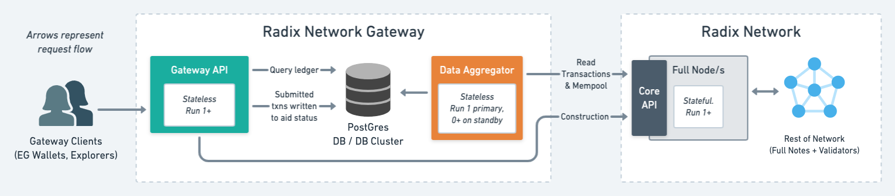

# Deployment guidelines

## Expected deployment

The Network Gateway, once complete, is designed to be deployed as per the below image.

Whilst the system can be run with one of each component, a resilient deployment would include:

* Multiple Gateway APIs
* A managed database cluster, with read replicas.
* The Data Aggregator reading from two or more full nodes.
* [Support coming soon] A Data Aggregator primary and inactive secondary (which will take over should the primary fail to write to the database for a pre-determined time)

## Running a radixdlt full node for the Core API

If you wish to run a Network Gateway, you will need to have a radixdlt full node to connect to.

As the Core API is designed to not be exposed publicly, you will need to run your own full node/s, and expose this API for your own needs.

* For development purposes, you can either:
  * Connect to a pre-existing full node. A syncing full node and the data aggregator are both quite resource intensive, so it can help to run at least the full node off of your local machine. If at RDX Works, we have some Core APIs you can connect to off your local machine - talk to your team lead about getting access to these.
  * Run a full node locally, using a docker image at build version 1.1.0+. At time of writing, the latest is [release 1.1.0](https://github.com/radixdlt/radixdlt/releases/tag/1.1.0), available as docker tag [radixdlt/radixdlt-core:1.1.0](https://hub.docker.com/r/radixdlt/radixdlt-core/tags). The toy deployment in this folder uses this approach.
  * Run a development build of a full node: [eg following this guide](https://github.com/radixdlt/radixdlt/blob/develop/docs/development/run-configurations/connecting-to-a-live-network-in-docker.md)

* For production purposes, you should run a radixdlt full node exposing the Core API. We do not yet have a full node build exposing the Core API which is
  released for production use.

# Configuration and Monitoring

For information on how to configure and monitor the Network Gateway components, see [/docs/configuration](../docs/configuration.md) and [/docs/monitoring](../docs/monitoring.md).

# Running a Network Gateway and/or Core API node locally

> ⚠️ &nbsp; This toy set-up should **NOT** be used for production - the memory limits, passwords etc are all incorrect for production use. It is also recommended not to run stateful services such as databases in containers.

The toy deployment is built with Docker Compose, and allows you to easily spin up various combinations of the infrastructure to fit your development needs,
including developing integrations, testing full or partial stacks, and as a demonstration for how services can be connected and configured.

## Preparing to run the toy set-up

* Open a new terminal.
* Install docker compose if you don't already have it. You require `docker-compose --version` greater than 1.27.0.
* Check out this `/deployment` folder as its working directory.
* Copy `.template.env` to `.env` by running this command: `cp .template.env .env` 
* Configure the `.env` to suit your needs - see below.

### Configuring .env

By default, the `.env` should be set up to connect to `stokenet`. If you have a different full node to connect to, you can configure that instead.

There are a number of changes you may wish to make in `.env`, eg in order to:

* Change which network it runs against.
  * By default, it runs against `stokenet`
  * You will want to change `FULLNODE_NETWORK_ID`, `FULLNODE_NETWORK_BOOTSTRAP_NODE` and `NETWORK_NAME`.
* Configure the Network Gateway point to a different full node / Core API
  * By default, it points to the full node spun up in docker-compose
  * You may wish to change `DISABLE_CORE_API_CERTIFICATE_CHECKS`, `NODE_0_CORE_API_ADDRESS` and `NODE_0_CORE_API_AUTHORIZATION_HEADER`
* Configure multiple full nodes or other set-ups.
  * By default, it only spins up one of each component.
  * You'll likely need to edit the `docker-compose.yml` file too.

## Starting the services

To run the set-up, execute one of the following scripts:

* `run-full-stack-from-images.sh` - Runs the whole stack, without needing to run any code locally. This is ideal for playing about with the Gateway API, or developing against it, without needing to build any code.
* `run-only-fullnode.sh` - Runs only a full node. This is useful for developing on the Network Gateway.
* `run-full-stack-with-built-network-gateway.sh` - Runs the full stack with a built network gateway. Useful for developing/testing the Network Gateway code in an integrated setup.
* `run-only-built-network-gateway.sh` - This runs only the built network gateway. This is useful for testing configuration of a Network Gateway against a non-local full node.

## Debugging

* On first load, you might get a few transient errors as things boot-up, and connection or precondition checks fail - but after 30 seconds or so,
errors should stabilise and logs should appear in a working state, with the data aggregator ingesting transactions.
* If PostgreSQL isn't booting up, try deleting `container-volumes/.postgresdata`
* If one of the services dies, it can cause the others to start erroring. You can check this in docker desktop to see which services are still running. Try killing them and starting them again.
* If you want to clear the node's ledger and the DB contents (say, because you wish to point at a different network), simply delete the folders `container-volumes/fullnode/ledger` and `container-volumes/.postgresdata`.

## Interacting with the system

### Network Gateway

Try:

* GET http://localhost:5308/swagger/ - Swagger on Gateway API (if enabled)

Or some diagnosis endpoints:

* GET http://localhost:5207 - Root overview for Data Aggregator
* GET http://localhost:5207/health - Health check on Data Aggregator
* GET http://localhost:1234/metrics - Metrics for Data Aggregator
* GET http://localhost:5308 - Root overview check for Gateway API
* GET http://localhost:5308/health - Health check on Gateway API
* GET http://localhost:1235/metrics - Metrics for Gateway API

### RadixDLT Core API on the full node

If you chose to run a full node through docker, you can also try out the Core API, changing out "stokenet" for the current network:

* `curl --request POST 'localhost:3333/network/configuration' --data-raw '{}'`
* `curl --request POST 'localhost:3333/network/status' --data-raw '{"network_identifier":{"network":"stokenet"}}'`

